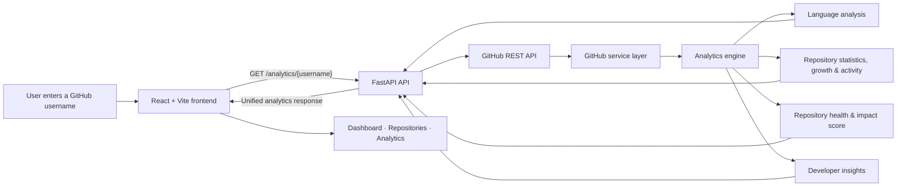

<div align="center">

# GitSpective

### A new perspective on GitHub — turn public developer data into a visual story.

**GitHub, explained beautifully.** Explore the experience behind a profile: the projects, technologies, consistency, and signals of developer impact.

[](https://react.dev/)
[](https://vite.dev/)
[](https://fastapi.tiangolo.com/)
[](https://www.python.org/)
[](https://docs.github.com/en/rest)
[](https://recharts.org/)

</div>

---

## What is GitSpective?

GitHub profiles contain a rich record of a developer's work, but understanding that record normally means manually opening repositories, comparing languages, scanning activity, and interpreting stars, forks, and contribution signals one by one.

GitSpective turns that scattered public data into an interactive analytics experience. Enter a GitHub username and the application fetches the profile and repository portfolio, calculates health and impact signals, then presents the result through a polished dashboard built for quick, meaningful exploration.

It is designed to help developers understand the story their portfolio tells—and to help recruiters and collaborators assess coding patterns, project diversity, maintenance habits, and visible impact without opening every repository.

## Product experience

The application is organised around three focused views:

| View | What it answers |
| --- | --- |
| **Dashboard** | Who is this developer? A profile snapshot, key portfolio stats, top languages, commit context, impact score, and generated insights. |
| **Repositories** | What does their project portfolio look like? Repository cards, portfolio totals, activity summary, and a health-score leaderboard. |
| **Analytics** | What story does the data tell? Language distribution, repository growth, activity and maintenance signals, health distribution, impact breakdown, and recommendations. |

> GitSpective is more than a profile viewer: it translates repository metadata into a clearer picture of how a developer builds and maintains software.

## Features

### Dashboard

- Search and analyse any public GitHub username.
- View profile identity, bio, company, location, website, follower count, and public repository count.
- Review portfolio totals for repositories, followers, following, and stars.
- Surface top language, most-starred project, most active month, and public commit context when GitHub makes that data available.
- Present a custom **Impact Score** with a clear level and explanatory summary.
- Generate a developer type, primary insight, secondary observations, and actionable improvement suggestions.

### Repository portfolio

- Browse public repositories in a responsive card grid.
- Inspect repository metadata: description, language, stars, forks, topics, license, homepage, and update dates.
- Rank projects by a per-repository **Health Score**.
- Highlight strengths and improvement opportunities around documentation, maintenance, metadata, and community signals.
- Summarise active versus inactive repositories and overall maintenance consistency.
- Show the strongest repositories in a health-score leaderboard and reveal portfolio growth over time.

### Analytics

- Visualise language distribution across public repositories.
- Track year-by-year repository creation growth.
- Break down impact into repository health, activity, community engagement, technology diversity, and portfolio signals.
- Analyse maintenance recency and activity level across the portfolio.
- Show repository-health distribution and consolidate portfolio recommendations.
- Use animated, responsive charts built with Recharts to make the data easier to scan.

### Platform details

- FastAPI backend with a dedicated service, route, analytics, and model layer.
- GitHub REST API integration with optional authenticated requests via `GITHUB_TOKEN`.
- A unified endpoint that bundles the full report for a fast dashboard experience.
- Responsive React interface with React Router, Framer Motion, Lucide icons, and a mobile navigation menu.
- Configurable frontend API address through `VITE_API_URL`.

## Tech stack

| Area | Technologies |
| --- | --- |
| Frontend | [](https://react.dev/) [](https://vite.dev/) [](https://reactrouter.com/) [](https://tailwindcss.com/) [](https://recharts.org/) [](https://www.framer.com/motion/) |
| Backend | [](https://www.python.org/) [](https://fastapi.tiangolo.com/) [](https://www.uvicorn.org/) [](https://docs.pydantic.dev/) |
| Data & APIs | [](https://docs.github.com/en/rest) [](https://pandas.pydata.org/) [](https://numpy.org/) |

## Architecture



The frontend calls the unified analytics endpoint for a profile. FastAPI retrieves public GitHub data through the service layer, runs the analytics modules, and returns one report containing the profile, repositories, scores, visualisation data, and insights.

## Project structure

```text
Github_Profile_Dashboard_Analysis/
├── backend/
│   ├── analytics/                 # Language, health, activity, growth, impact & insight calculations
│   ├── models/                    # Pydantic response/domain models
│   ├── routes/                    # FastAPI endpoint modules
│   ├── services/                  # GitHub REST API integration
│   ├── utils/                     # Configuration helpers
│   ├── requirements.txt
│   └── main.py                    # FastAPI app and CORS configuration
├── frontend/
│   ├── public/                    # Static assets
│   ├── src/
│   │   ├── components/            # Reusable UI and visualisation components
│   │   ├── context/               # Shared analytics state
│   │   ├── pages/                 # Landing, Dashboard, Repositories & Analytics views
│   │   ├── services/              # Frontend API client
│   │   ├── App.jsx                # Routes
│   │   └── main.jsx
│   └── package.json
├── docs/                          # API notes, design system & sample response
└── README.md
```

## Getting started

### Prerequisites

- [Node.js](https://nodejs.org/) 20+ and npm
- [Python](https://www.python.org/downloads/) 3.10+
- A GitHub personal access token is recommended to avoid unauthenticated GitHub API rate limits.

### 1. Clone the repository

```bash
git clone https://github.com/akshicodes/Github_Dashboard_Analysis.git
cd Github_Dashboard_Analysis
```

### 2. Start the backend

From the project root:

```bash
python -m venv .venv
```

Activate the virtual environment:

```powershell
# Windows PowerShell
.\.venv\Scripts\Activate.ps1
```

```bash
# macOS / Linux
source .venv/bin/activate
```

Install the backend dependencies and start FastAPI:

```bash
pip install -r backend/requirements.txt
uvicorn backend.main:app --reload
```

The API runs at `http://127.0.0.1:8000`. Interactive API documentation is available at `http://127.0.0.1:8000/docs`.

Create `backend/.env` if it does not already exist, then add your token:

```env
GITHUB_TOKEN=your_github_personal_access_token
```

### 3. Start the frontend

Open a second terminal:

```bash
cd frontend
npm install
npm run dev
```

Vite serves the application on the local URL printed in the terminal (normally `http://localhost:5173`). The default frontend configuration points to `http://127.0.0.1:8000`; override it for another API host with `VITE_API_URL`.

### Available scripts

```bash
# from frontend/
npm run dev       # start the Vite development server
npm run build     # create a production build
npm run preview   # preview the production build
npm run lint      # run Oxlint

# from the repository root
uvicorn backend.main:app --reload  # run the FastAPI backend
```

## API endpoints

**Base URL:** `http://127.0.0.1:8000`

| Method | Endpoint | Purpose |
| --- | --- | --- |
| `GET` | `/` | API status message |
| `GET` | `/health` | Backend health check |
| `GET` | `/profile/{username}` | Public GitHub profile details |
| `GET` | `/repositories/{username}` | Public repository metadata |
| `GET` | `/languages/{username}` | Language distribution and technology usage |
| `GET` | `/repository-statistics/{username}` | Portfolio totals, averages, stars, forks, and top repositories |
| `GET` | `/repository-growth/{username}` | Year-by-year repository creation data |
| `GET` | `/repository-activity/{username}` | Activity level and maintenance consistency |
| `GET` | `/repository-health/{username}` | Per-repository health reports and recommendations |
| `GET` | `/impact-score/{username}` | Overall impact score and scoring breakdown |
| `GET` | `/developer-insights/{username}` | Developer type, observations, and suggestions |
| `GET` | `/analytics/{username}` | Complete bundled analytics report used by the frontend |

Example request:

```bash
curl http://127.0.0.1:8000/analytics/octocat
```

## What I learned

- Designing a layered **FastAPI architecture** that separates routing, GitHub data access, analytics logic, and models.
- Working with the **GitHub REST API**, including public-profile data, repository metadata, authentication tokens, and rate-limit-aware development.
- Converting raw repository information into useful analytics: language diversity, maintenance activity, portfolio growth, health scoring, and impact signals.
- Building a responsive **React** product experience with shared state, client-side routing, loading/error states, and reusable components.
- Applying data-visualisation principles with **Recharts** so charts answer practical questions instead of simply displaying numbers.
- Designing analytics interfaces that help a viewer move from raw metrics to a clear narrative about a developer's work.

## Acknowledgements

This project is powered by and built with inspiration from:

- [GitHub REST API](https://docs.github.com/en/rest)
- [FastAPI](https://fastapi.tiangolo.com/)
- [React](https://react.dev/)
- [Chart.js](https://www.chartjs.org/)

## Author

Built by **Sonakshi Sutradhar** · [GitHub @akshicodes](https://github.com/akshicodes) · [LinkedIn](https://www.linkedin.com/in/sonakshi-sutradhar/)

---

<div align="center">

If GitSpective helped you see a GitHub profile differently, consider giving the project a star.

</div>
